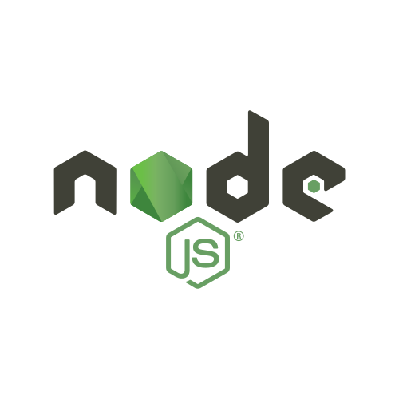
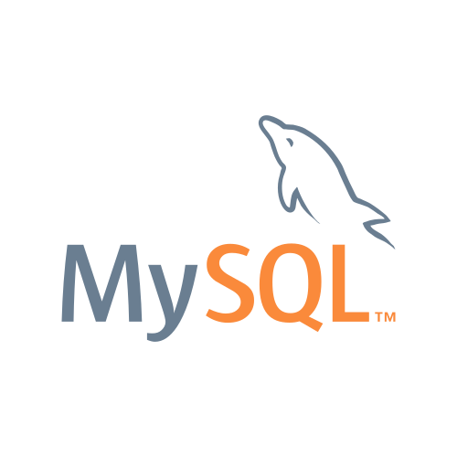
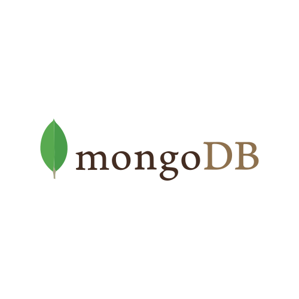
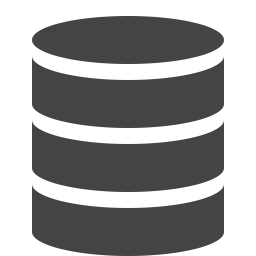
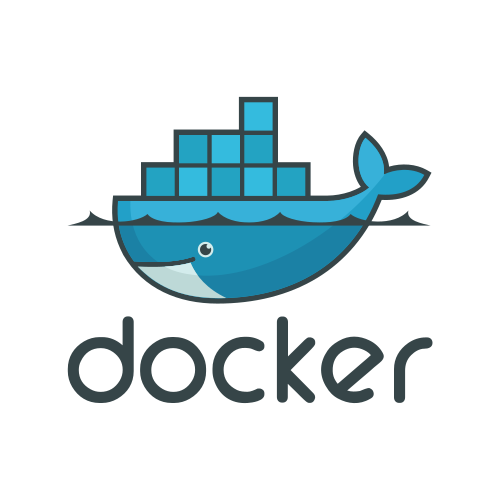
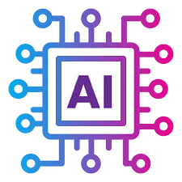

# Mengyun Xie
🚀 Software Engineer | Full-Stack Developer | AI Explorer | Programming Enthusiast

## 👩‍💻 About Me

🎓 Master of Science in Computer Software Engineering @ Northeastern University

🎓 Bachelor’s in Electrical Engineering @ Minnan Normal University

💼 4+ years of software development experience across IoT, healthcare, and education industries

🤖 Passionate about using tech to solve real-world problems and create meaningful user experiences 

🧩 Been playing with code for over 10 years—turning curiosity into real-world solutions

🌍 Enjoy creating art, drawing, traveling, and embracing the beauty of life and our Earth

## Technical Skills

### Programming Languages  

Java, C/C++, Swift, JavaScript/TypeScript, Python, SQL, HTML/CSS, XML

### Web Development  
- **Front-End:** React, Angular, Vue, HTML5, CSS3
- **Back-End:** Spring, Spring Boot, Node.js, Express.js, Django, FastAPI, gRPC, REST APIs, Kafka
- **Databases:** MySQL, PostgreSQL, MongoDB, Cassandra, Redis, SQL Server, DBeaver  
- **Testing:** A/B Testing, JUnit, Mockito

### Tools & DevOps  
- **Tools & Platforms:** Git, Maven, CI/CD, GitHub Actions, Jenkins, Postman, Jira, Tomcat, Nginx, Linux, TCP/IP
- **Cloud & Infrastructure:** AWS, Google Cloud Platform (GCP), Microsoft Azure, Docker, Kubernetes

### Data & AI  
- **Data Wrangling:** Pandas, NumPy  
- **ML Frameworks:** Scikit-learn, TensorFlow  
- **Visualization:** Tableau, Matplotlib, Seaborn

## Certifications & Learning

- AI for Personalized Learning (Northeastern University)  
- Object-Oriented Programming in Java (UC San Diego - Coursera)  
- Data Science Engineering with Python (Northeastern University)  
- The Complete Android N Developer Course (Udemy)

## Let’s Connect

- 💼 [LinkedIn](https://www.linkedin.com/in/mengyunxie)  
- 🌐 [Portfolio Website](https://mengyunxie.github.io/) 
- 📬 Email: xie.mengyun.ai@gmail.com

## License

This repository is licensed under copyright.  
All rights reserved. Content reuse or redistribution is prohibited without permission.
